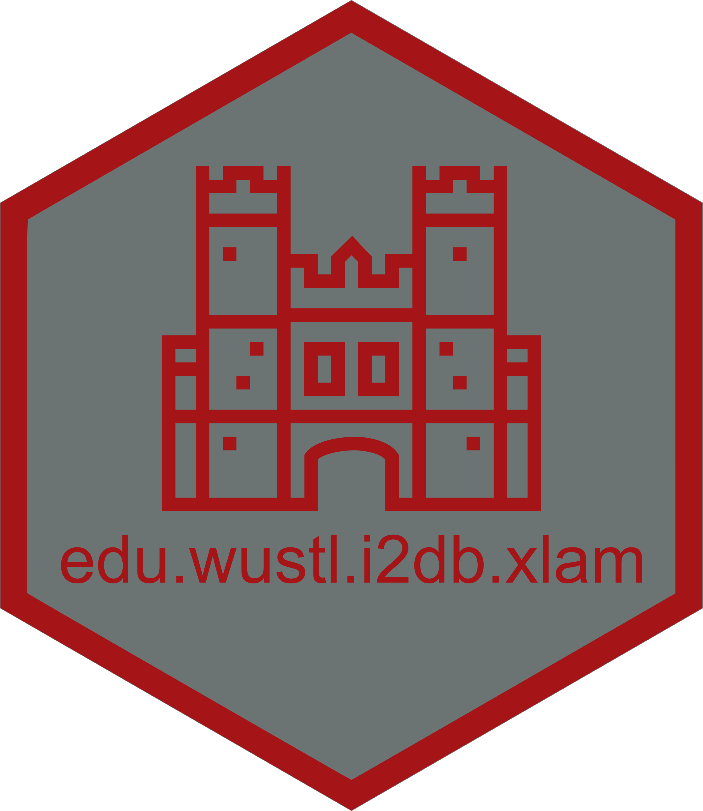

<!-- README.md is generated from README.Rmd. Please edit that file -->

# edu.wustl.i2db.xlam 

<!-- badges: start -->

<!-- badges: end -->

## Overview

This repository contains a Microsoft Excel add-in which provides a
custom ribbon and additional functions for the [Institute for
Informatics, Data Science & Biostatistics](https://i2db.wustl.edu/).

 

## Installation

1.  Download the latest
    [release](https://github.com/the-mad-statter/edu.wustl.i2db.xlam/releases)
2.  Place the “edu.wustl.i2db.xlam” file in C:\Users\\your
    account\>\AppData\Roaming\Microsoft\AddIns
3.  Right click the file, select Properties, and unblock the file (if
    necessary)
4.  Open Excel
5.  Click Options
6.  Click Add-ins
7.  Make sure “Excel Add-ins” is selected in the Manage drop down box
    and click the Go button
8.  Check the box next to “edu.wustl.i2db.xlam” and click the OK button

You should now have a custom ribbon and additional functions which all
start with I2DB (e.g., I2DB_HMACSHA265()).

 

## Usage

Documentation is available
[here](https://the-mad-statter.github.io/edu.wustl.i2db.xlam)

 

## Code of Conduct

Please note that the edu.wustl.i2db.xlam project is released with a
[Contributor Code of
Conduct](https://contributor-covenant.org/version/2/0/CODE_OF_CONDUCT.html).
By contributing to this project, you agree to abide by its terms.

 

## About

### Washington University in Saint Louis 

Established in 1853, [Washington University in Saint
Louis](https://www.wustl.edu) is among the world’s leaders in teaching,
research, patient care, and service to society. Bosting 24 Nobel
laureates to date, the University is ranked 7th in the world for most
cited researchers, received the 4th highest amount of NIH medical
research grants among medical schools in 2019, and was tied for 1st in
the United States for genetics and genomics in 2018. The University is
committed to learning and exploration, discovery and impact, and
intellectual passions and challenging the unknown.
