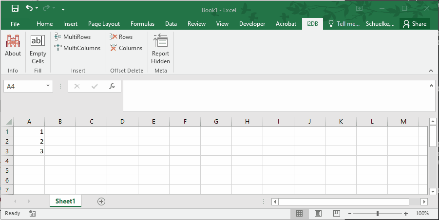

```{r setup, include=FALSE}
knitr::opts_chunk$set(echo = TRUE)
```

# Installation
  
1. Download the latest [release](https://github.com/`r params$github`/`r params$package`/releases)
2. Place the "`r params$package`" file in C:\\Users\\&lt;your account&gt;\\AppData\\Roaming\\Microsoft\\AddIns
3. Right click the file, select Properties, and unblock the file (if necessary)
4. Open Excel
5. Click Options
6. Click Add-ins
7. Make sure "Excel Add-ins" is selected in the Manage drop down box and click the Go button
8. Check the box next to "`r params$package`" and click the OK button


# Ribbon

## Fill

### Empty Cells

Fill empty cells in a selection with a given value.


## Insert

### MultiRows

Insert multiple rows at one time above the current selection.



### MultiColumns

Insert multiple columns at one time to the left of the current selection.


## Offset Delete

### Rows

Delete every so many other rows in a selection.


### Columns

Delete every so many other columns in a section.


## Meta

### Report Hidden

See a report on the presence of any hidden rows or columns.


# Functions

## =I2DB_HMACSHA256(value, key)

Given a value and secret key, compute a Hash-based Message Authentication Code (HMAC) using the SHA256 hash function


